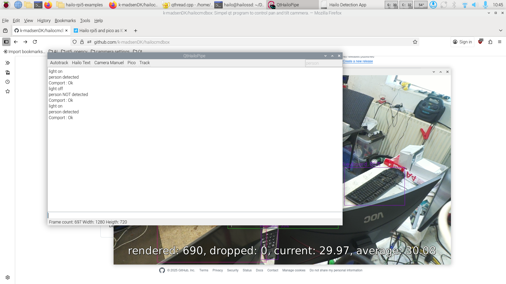

# hailocmdbox
Simpel qt program to control pan and tilt cammera.

The program is to be used with with a rpi5 hailo+ hat rpi pico and a Pimoroni Pan-Tilt HAT.
The hailo chain will check the text straem from the hailo chip (madsen.py) and if any "label" is detected then sending box cords to the pico via serial usb

In default mode the program will auto track "label" with the higest confidence score.

Default Label name is "person"

